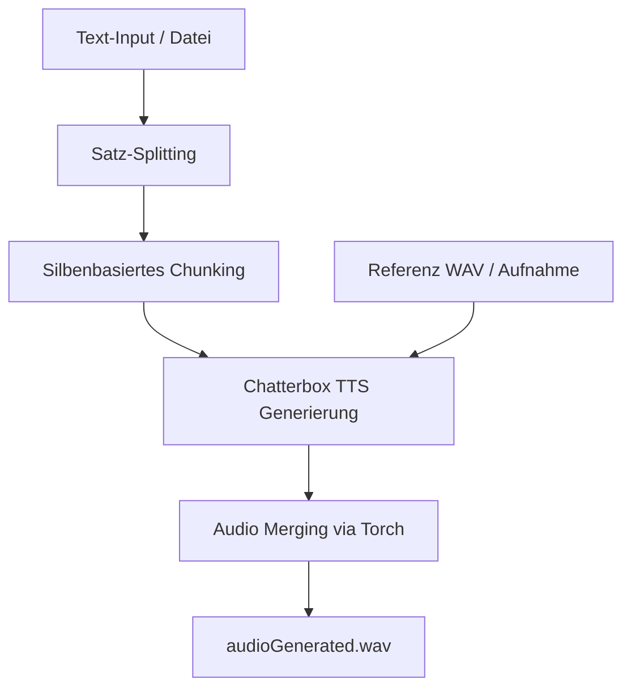

# German Voice Output Generator

Dieses Skript ermöglicht die Generierung von hochwertiger deutscher Sprachausgabe aus Text oder Textdateien unter Verwendung von `Chatterbox Multilingual TTS`. Es unterstützt Voice Cloning durch eine bereitgestellte Referenz-WAV-Datei. 

*Note: Es wurde bisher nur auf Windows 11 getestet.*

## Funktionen

- **Text-to-Speech (TTS):** Konvertiert direkten Text oder Textdateien in Sprache.
- **Voice Cloning:** Verwendet eine Referenzdatei (`.wav`), um die Stimme für die Ausgabe zu bestimmen.
- **Interaktive Pegelanzeige:** Bietet während der Mikrofonaufnahme ein visuelles Echtzeit-Feedback der Lautstärke (RMS-basiert).
- **Automatisches Chunking:** Teilt lange Texte intelligent in kleinere Abschnitte (basierend auf Silbenanzahl) auf, um die Verarbeitungsqualität zu optimieren und Speicherprobleme zu vermeiden.
- **GPU-Beschleunigung:** Nutzt CUDA für eine schnelle Audiogenerierung.
- **Audio-Merging:** Kombiniert generierte Fragmente nahtlos zu einer finalen `audioOutput.wav`.

## Voraussetzungen

Installieren sie [chatterbox](https://huggingface.co/ResembleAI/chatterbox-turbo). Ich musste leider für meine 3090 chatterbox manuell installieren. Siehe auch https://huggingface.co/ResembleAI/chatterbox/discussions/10.

Am besten erstellen sie ein python environment mit 

```bash
python3 -m venv .venv
.venv\Scripts\Activate.ps1
```

Stellen Sie sicher, dass die benötigten Bibliotheken installiert sind:

```bash
pip install -r requirements.txt
```

Zudem wird eine funktionierende CUDA-Umgebung für die GPU-Beschleunigung empfohlen.

## Verwendung

Das Skript wird über die Kommandozeile gesteuert.

### Parameter

| Parameter | Beschreibung |
| :--- | :--- |
| `-t`, `--text` | Direkter Text, der vorgelesen werden soll (in Anführungszeichen). |
| `-f`, `--file` | Pfad zu einer Textdatei, deren Inhalt konvertiert werden soll. |
| `-w`, `--wav` | (Optional) Pfad zur Referenz-WAV-Datei für die Stimme. Standard: `recordedSample.wav`. |
| `-r`, `--record` | (Optional) Startet die Mikrofonaufnahme zur Erstellung einer Sprachvorlage. |

### Mikrofonaufnahme (`--record`)

Bei Verwendung des `--record` Parameters startet das Programm im Aufnahmemodus:
1. Halten Sie die **SHIFT-Taste** gedrückt, um die Aufnahme zu starten.
2. Während der Aufnahme erscheint eine **dynamische Pegelanzeige** in der Konsole. Diese visualisiert die aktuelle Lautstärke (RMS), die unter Verwendung von `numpy` in Echtzeit berechnet wird.
3. Sobald Sie die **SHIFT-Taste** loslassen, wird die Aufnahme beendet und als `recordedSample.wav` gespeichert.

Das flüssige visuelle Feedback sorgt für eine professionelle Kontrolle der Eingabelautstärke und stellt sicher, dass das Mikrofon korrekt konfiguriert ist.

### Beispiele

**Direkter Text:**
```bash
python generateGermanVoiceOutput.py -t "Hallo, dies ist ein Test der Sprachausgabe." -w meineStimme.wav
```

**Text aus einer Datei:**
```bash
python generateGermanVoiceOutput.py -f skript.txt -w Pfad\zu\meiner\audioDatei.wav
```

**Aufnahme einer neuen Sprachvorlage:**
```bash
python generateGermanVoiceOutput.py --record
```

## Funktionsweise

Das Programm ist in vier Hauptphasen unterteilt, um eine effiziente und qualitativ hochwertige Sprachausgabe zu gewährleisten:

### 1. Textverarbeitung und Chunking
Zuerst wird der Eingabetext (aus der Kommandozeile oder einer Datei) normalisiert. Um Speicherüberläufe zu vermeiden und die Qualität des TTS-Modells optimal zu nutzen, wird der Text in kleinere Abschnitte (Chunks) unterteilt.
- **Silben-Heuristik:** Die Funktion `countSyllables` schätzt die Anzahl der Silben basierend auf Vokalgruppen.
- **Satzbasiertes Splitting:** Der Text wird primär an Satzzeichen (`.`, `:`, `!`, `?`) getrennt und dann zu Chunks von ca. 100 Silben gruppiert.

### 2. Modell-Initialisierung (CUDA/GPU)
Das Skript nutzt das `ChatterboxMultilingualTTS` Modell. Es ist standardmäßig auf die Nutzung von **CUDA** ausgelegt, um die Generierung durch GPU-Beschleunigung massiv zu beschleunigen.

### 3. TTS-Generierung (Voice Cloning)
Für jeden Text-Chunk generiert das Modell eine Audio-Sequenz. Dabei dient eine externe WAV-Datei (entweder eine vorhandene oder eine frisch mit `--record` aufgenommene) als "Audio Prompt". Das Modell extrahiert die Charakteristika dieser Stimme und wendet sie auf den generierten Text an.

### 4. Merging und Speicherung
Die einzelnen Audio-Fragmente (Tensors) werden mittels `torch.cat` nahtlos aneinandergefügt. Das finale Ergebnis wird mit `torchaudio.save` als `audioGenerated.wav` gespeichert.

## Architektur-Ablauf



## Technische Details

- **TTS-Engine:** `Chatterbox Multilingual TTS` (HuggingFace: `ResembleAI/chatterbox-turbo`).
- **Hardware-Nutzung:** Optimiert für NVIDIA GPUs via `torch` und `CUDA`.
- **Audio-Input:** `pyaudio` ermöglicht die direkte Aufnahme vom Mikrofon.
- **Steuerung:** Die `keyboard`-Bibliothek erlaubt eine intuitive Steuerung der Aufnahme (Shift-Taste).
- **Pegelmessung:** `numpy` berechnet den RMS-Wert (Root Mean Square) für die Echtzeit-Pegelanzeige.

## Dateistruktur

- **`generateGermanVoiceOutput.py`**: Das Hauptskript für Aufnahme und Generierung.
- **`recordedSample.wav`**: Standard-Zieldatei für Mikrofonaufnahmen.
- **`audioGenerated.wav`**: Das final generierte Sprach-Audio.
- **`test.txt`**: (Optional) Beispielhafte Eingabedatei für längere Texte.
